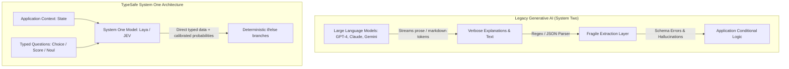

# 01. System One Philosophy & Architecture

## 1. System One vs System Two Cognitive Paradigms

The distinction between "System 1" and "System 2" originates from Daniel Kahneman's cognitive theory (*Thinking, Fast and Slow*):
- **System 1**: Fast, automatic, subconscious pattern recognition, minimal computational energy. Examples: recognizing a familiar face, reading a traffic sign, sensing irritation in a caller's voice.
- **System 2**: Slow, sequential, deliberative logical reasoning, high computational cost. Examples: calculating $17 \times 24$, formulating a philosophical thesis, complex multi-stage project planning.

### Why Modern Software Demands System One

The vast majority of software execution branches do not require an LLM to generate creative essays. They simply require a fast, deterministic judgment:
- "Which department should handle this ticket?" (`support`, `billing`, `sales`)
- "Does this payload contain signs of social engineering or fraud?" (Yes / No)
- "What is the customer's sentiment intensity on a 0–2 scale?"
- "Is this search context relevant to the incoming user query?"

Using standard generative LLMs for these operations introduces four major failure modes:
1. **Excessive Latency**: Awaiting token-by-token generation incurs a 1,000ms to 5,000ms penalty per step.
2. **Punitive Costs**: You pay for preamble words, markdown fluff, and unnecessary explanations.
3. **Fragile Schemas**: Generative models frequently hallucinate field names, emit broken JSON syntax, or insert unrequested disclaimers.
4. **Uncalibrated Confidence**: When an LLM outputs "Yes", the caller cannot determine whether it is 99% certain or guessing at 51%.

---

## 2. Jev & Laya: Purpose-Built System One Engines

**Jev** (cloud-scale triage) and **Laya-MLX** (local on-device inference) are foundation models built specifically for software:
- **Zero Prose Generation**: They do not emit free-form text. They ingest arbitrary state and evaluate directly against typed questions.
- **Strictly Typed Outputs**: Responses map 1:1 with programming language types (TypeScript schemas, Python Pydantic models).
- **Calibrated Probabilities**: If the engine outputs a probability of $0.85$ for a label, empirical observation verifies that in 85 out of 100 cases, the prediction is factually correct.
- **Epistemic Confidence Scores**: Provides an independent dimension distinguishing probability distribution (`probability`) from epistemic certainty based on context completeness (`confidence`).

---

## 3. The "Code in Control" Principle

A common anti-pattern in agentic engineering is delegating the entire runtime control flow to an autonomous model. This inevitably leads to runaways, unpredictable cloud bills, and nondeterministic bugs.

Under `design-os-system-one`, the governing invariant is: **Code always retains control.**

| System Component | Code Responsibility | System One Model Responsibility |
| :--- | :--- | :--- |
| **Business Logic** | 100% of business logic, numeric computation, and conditional branches | Provides semantic evaluations at specific decision gates |
| **Data & State** | Database queries, schema validation, data sanitization | Ingests and interprets natural language context |
| **Side Effects (Mutations)** | Sends emails, writes transactions, executes payments | **Never** allowed to trigger side effects directly |
| **Risk & Fallback** | Enforces confidence thresholds, triggers human escalation | Reports mathematically calibrated probabilities and confidence |

---

## 4. Performance & Cost Benchmarks

Empirical benchmarking confirms:
- **Throughput**: Batching typed questions against System One is **10.0x faster** than prompting an equivalent LLM.
- **Cost**: **12.2x cheaper** in cloud APIs, and **100% free ($0.00)** when resolved locally via Laya-MLX.
- **Deterministic Schema**: Returned JSON strictly adheres to the schema contract, eliminating JSON parsing errors entirely.
