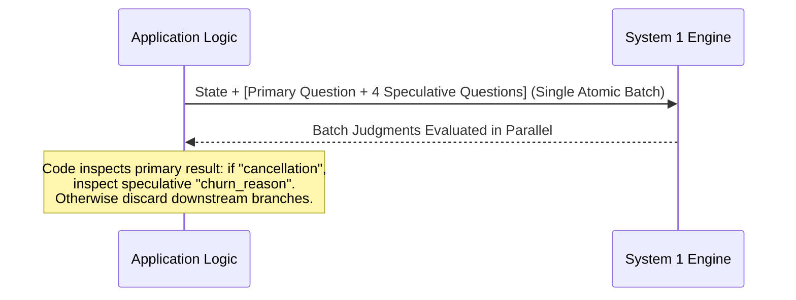

# 08. Golden Architectural Patterns

This guide synthesizes 5 core software design patterns engineered specifically for deploying System 1 models in high-scale production systems.

---

## Pattern 1: Speculative Fan-Out

### Problem
In standard procedural architectures, applications wait for initial classification before determining which follow-up questions to query. This creates high-latency sequential network waterfalls.

### Solution
Because System 1 parallel batching incurs near-zero additional latency and cost, dispatch **all anticipated speculative questions** in the initial request. Your application logic inspects the primary answer and reads downstream speculative results only if relevant.



### Reference Implementation
```python
# Batch primary classification and hypothetical follow-ups in 1 call
response = client.system_one(
    state=user_feedback,
    questions={
        "topic": Choice(
            instructions="Primary feedback category",
            criteria={"billing": "Payment & Invoices", "bug": "Software Defect", "feature": "Feature Request"}
        ),
        # Speculative branch if billing:
        "billing_dispute": Noul(instructions="User disputes a specific charge"),
        # Speculative branch if bug:
        "is_blocker": Noul(instructions="Defect completely halts core workflow"),
        # Globally useful across all branches:
        "frustration": Score(
            instructions="Frustration intensity",
            criteria=["Calm", "Moderately annoyed", "Extremely hostile"]
        )
    }
)

topic = response.answers["topic"].choice
if topic == "billing" and response.answers["billing_dispute"].noul > 0.8:
    trigger_finance_investigation()
elif topic == "bug" and response.answers["is_blocker"].noul > 0.8:
    page_oncall_engineer()
```

---

## Pattern 2: Confidence-Gated Circuit Breaker

### Problem
AI models inherently possess error margins on out-of-distribution edge cases. Unchecked 100% automation risks catastrophic production incidents.

### Solution
Employ `confidence` as a formal circuit breaker:
- `confidence >= 0.80`: Autonomous execution approved.
- `confidence < 0.80`: Route to Human-in-the-Loop review queue along with initial probability distributions.

---

## Pattern 3: Composite Multi-Factor Scoring

### Problem
Asking an AI model to evaluate a candidate or enterprise credit risk on an arbitrary 1–100 scale yields subjective, hallucinated, and unexplainable scores.

### Solution
Decompose the complex decision into atomic dimensions evaluated via `Score` and `Noul`. **Your code retains the weighting formula**:

```python
# 1. Measure atomic dimensions independently
res = client.system_one(
    state=candidate_resume,
    questions={
        "relevant_experience": Score(
            instructions="Alignment of practical experience with Senior Backend role",
            criteria=["Under 2 years or non-adjacent", "3-5 years directly aligned", "Over 5 years deep architecture"]
        ),
        "system_design_evidence": Noul(
            instructions="Resume demonstrates distributed systems and high-throughput design experience"
        ),
        "communication_clarity": Score(
            instructions="Clarity and quantification of engineering achievements",
            criteria=["Disorganized, no metrics", "Sufficiently clear", "Extensively quantified with rigorous metrics"]
        )
    }
)

# 2. Application code owns the business weighting logic
exp_score = (res.answers["relevant_experience"].score / 2.0) * 0.40  # 40% weight
sys_score = res.answers["system_design_evidence"].noul * 0.35        # 35% weight
com_score = (res.answers["communication_clarity"].score / 2.0) * 0.25 # 25% weight

final_weighted_score = (exp_score + sys_score + com_score) * 100
print(f"Composite Score: {final_weighted_score:.1f} / 100")
```

---

## Pattern 4: 3-Tier Intent Gateway

### Problem
Directing every inbound user query to expensive frontier models (Claude 3.5 Sonnet / GPT-4o) wastes massive operational budget.

### Solution
Deploy System 1 as an ingress gatekeeper:

```
Incoming User Query
       │
       ▼
 ┌───────────┐
 │ System 1  │ ◄── Sub-10ms evaluation, zero token bloat
 └─────┬─────┘
       │
       ├─► [Branch 1: Structured / Deterministic Query] ──► Direct DB / API handler
       │    (e.g., "What is my current account balance?")
       │
       ├─► [Branch 2: Complex Synthesis / Reasoning] ──► Route to System Two LLM
       │    (e.g., "Synthesize an omnichannel marketing strategy")
       │
       └─► [Branch 3: High Churn / Hostile Grievance] ──► Route to Senior Account Rep
```

---

## Pattern 5: SDE (Structured Data Extraction) Cascade

### Problem
Extracting JSON from legal contracts and invoices using large reasoning models (o3 / Claude Opus) is accurate but costs thousands of dollars per month.

### Solution: 3-Stage Verification Cascade
1. **Tier 1 (Mini Extractor)**: A fast, lightweight extractor extracts raw entities into JSON.
2. **Tier 2 (System 1 Verifier)**: System 1 checks every extracted field against the source document (verifying factual fidelity and flagging hallucinations).
3. **Tier 3 (Heavy Model Arbitrator)**: Only records flagged by System 1 are escalated to the reasoning model for correction.
$\rightarrow$ **Result**: **85% reduction in API bills** while matching the accuracy of top-tier reasoning models.
