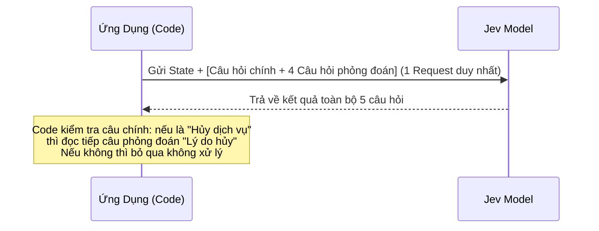

# 08. Các Kiến Trúc Mẫu (Architectural Patterns)

Tài liệu này tổng hợp 5 mô hình thiết kế phần mềm cốt lõi (Architectural Design Patterns) được phát triển riêng cho việc kết hợp Jev vào các hệ thống phần mềm quy mô lớn.

---

## Pattern 1: Speculative Fan-Out (Gửi Câu Hỏi Phủ Đầu)

### Vấn đề
Trong luồng xử lý thông thường, bạn thường phải chờ phân loại xong rồi mới biết cần hỏi thêm câu gì tiếp theo. Điều này tạo ra chuỗi gọi API tuần tự (Waterfall) làm tăng độ trễ nghiêm trọng.

### Giải pháp
Vì Jev cho phép hỏi nhiều câu cùng lúc với chi phí cực thấp, bạn có thể gửi **toàn bộ các câu hỏi phỏng đoán (speculative questions)** ngay trong lượt gọi đầu tiên. Code của bạn sẽ căn cứ vào câu trả lời đầu để quyết định xem những câu còn lại có cần đọc hay không.



### Triển khai mã mẫu
```python
# Gửi cả câu hỏi phân loại lẫn các câu đào sâu trong 1 lần gọi
response = client.system_one(
    state=user_feedback,
    questions={
        "topic": Choice(
            instructions="Chủ đề chính của phản hồi",
            criteria={"billing": "Thanh toán", "bug": "Lỗi phần mềm", "feature": "Đề xuất tính năng"}
        ),
        # Câu hỏi phỏng đoán nếu là Billing:
        "billing_dispute": Noul(instructions="Người dùng đang khiếu nại về khoản trừ vô lý"),
        # Câu hỏi phỏng đoán nếu là Bug:
        "is_blocker": Noul(instructions="Lỗi ngăn cản hoàn toàn việc hoàn thành công việc"),
        # Luôn hữu ích dù là topic nào:
        "frustration": Score(
            instructions="Mức độ ức chế",
            criteria=["Bình tĩnh", "Bực mình vừa", "Tức giận đỉnh điểm"]
        )
    }
)

topic = response.answers["topic"].choice
if topic == "billing" and response.answers["billing_dispute"].noul > 0.8:
    trigger_finance_investigation()
elif topic == "bug" and response.answers["is_blocker"].noul > 0.8:
    page_oncall_engineer()
```

---

## Pattern 2: Confidence-Gated Routing (Định Tuyến Dựa Trên Độ Tin Cậy)

### Vấn đề
Mô hình AI luôn có xác suất sai lệch ở các trường hợp biên (edge cases). Việc tự động hóa 100% không qua kiểm soát sẽ dẫn đến hậu quả nghiêm trọng về mặt kinh doanh.

### Giải pháp
Sử dụng `confidence` làm chốt an toàn (Circuit Breaker).
- `confidence >= 0.80`: Cho phép tự động hóa hoàn toàn.
- `confidence < 0.80`: Đẩy về hàng đợi nhân sự (Human-in-the-loop) kèm theo nhận định ban đầu của mô hình.

---

## Pattern 3: Composite Scoring (Chấm Điểm Hợp Thành Đa Nhân Tố)

### Vấn đề
Khi cần đánh giá một bài viết tuyển dụng, ứng viên, hay rủi ro tín dụng, yêu cầu mô hình chấm một điểm tổng quát duy nhất (ví dụ từ 1 đến 100) thường cho kết quả mơ hồ, thiếu nhất quán và không thể giải thích được nguyên nhân.

### Giải pháp
Chia nhỏ quyết định phức tạp thành các chỉ số nguyên tử (Atomic Dimensions) bằng Jev `Score` hoặc `Noul`. Sau đó, **code của bạn nắm giữ công thức tính toán trọng số**.

```python
# 1. Đo lường từng khía cạnh nguyên tử qua Jev
res = client.system_one(
    state=candidate_resume,
    questions={
        "relevant_experience": Score(
            instructions="Mức độ phù hợp của kinh nghiệm thực tế với vị trí Senior Backend",
            criteria=["Dưới 2 năm hoặc trái ngành", "3-5 năm đúng chuyên môn", "Trên 5 năm kinh nghiệm chuyên sâu"]
        ),
        "system_design_evidence": Noul(
            instructions="Hồ sơ thể hiện rõ năng lực thiết kế hệ thống phân tán, chịu tải cao"
        ),
        "communication_clarity": Score(
            instructions="Độ rõ ràng, súc tích trong cách trình bày thành tựu",
            criteria=["Rời rạc, thiếu số liệu", "Rõ ràng ở mức cơ bản", "Định lượng chi tiết bằng số liệu thuyết phục"]
        )
    }
)

# 2. Code nắm giữ trọng số tính điểm (Business Logic)
exp_score = (res.answers["relevant_experience"].score / 2.0) * 0.40  # Trọng số 40%
sys_score = res.answers["system_design_evidence"].noul * 0.35        # Trọng số 35%
com_score = (res.answers["communication_clarity"].score / 2.0) * 0.25 # Trọng số 25%

final_weighted_score = (exp_score + sys_score + com_score) * 100
print(f"Điểm số tổng hợp: {final_weighted_score:.1f}/100")
```

---

## Pattern 4: Intent Routing (Bộ Định Tuyến Ý Định 3 Cấp)

### Vấn đề
Gửi mọi tin nhắn người dùng vào một LLM thông minh và đắt tiền (như Claude 3.5 Sonnet / GPT-4o) là lãng phí tài nguyên.

### Giải pháp
Sử dụng Jev làm người gác cổng (Gatekeeper) tại tầng mạng đầu vào để định tuyến tin nhắn:

```
Tin nhắn người dùng
       │
       ▼
 ┌───────────┐
 │ Jev Model │ ◄── Tốc độ ~30ms, Chi phí siêu rẻ
 └─────┬─────┘
       │
       ├─► [Nhánh 1: Yêu cầu đơn giản / Có cấu trúc] ──► Code xử lý trực tiếp (SQL / API)
       │    (Ví dụ: "Số dư hiện tại của tôi là bao nhiêu?")
       │
       ├─► [Nhánh 2: Yêu cầu cần suy luận sâu / Sáng tạo] ──► Chuyển tiếp tới LLM System Two
       │    (Ví dụ: "Hãy tư vấn kế hoạch tiếp thị tháng tới")
       │
       └─► [Nhánh 3: Khiếu nại gay gắt / Khẩn cấp] ──► Chuyển thẳng nhân viên CSKH
```

---

## Pattern 5: SDE Cascade (Thác Trích Xuất Dữ Liệu Cấu Trúc)

### Vấn đề
Trích xuất JSON từ hợp đồng, hóa đơn bằng các mô hình Reasoning cỡ lớn (như o3 / Claude Opus) cho độ chính xác cao nhưng tốn kém hàng trăm USD mỗi ngày.

### Giải pháp: Thác 3 Tầng (3-Stage Cascade)
1. **Tầng 1 (Mini Model)**: Dùng một mô hình siêu nhẹ trích xuất nhanh dữ liệu vào JSON.
2. **Tầng 2 (Jev Verify)**: Dùng Jev kiểm tra từng trường dữ liệu trích xuất đối chiếu với văn bản gốc (Xác minh xem trường dữ liệu có chính xác không, có bị bịa đặt không).
3. **Tầng 3 (Heavy Model)**: Chỉ khi Jev gắn cờ cảnh báo (Flagged) thì bản ghi đó mới được gửi lên mô hình Reasoning cao cấp để sửa lại.
$\rightarrow$ **Kết quả**: Tiết kiệm tới **85% chi phí API** mà vẫn duy trì độ chính xác của mô hình hàng đầu!
